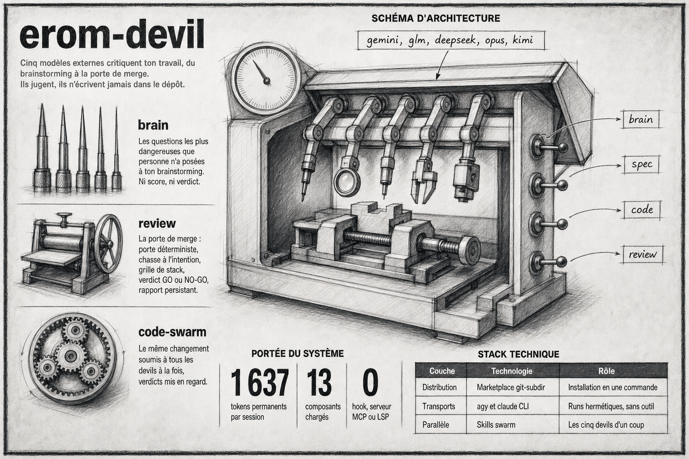

# erom-devil - avocats du diable pour la définition de besoins

Plugin Claude Code. Trois reviewers critiques externes (Gemini, GLM,
Deepseek), renforcés par Opus et Kimi en review unitaire, attaquent ton
travail sous quatre angles, du document amont à la porte de merge :

- **spec** : ils jugent une spec technique contre son brainstorm
  d'origine (dérives, manques, incohérences), score et verdict à la clé.
- **brain** : ils interrogent un brainstorming seul et rendent les
  questions les plus dangereuses jamais posées (angles morts, pans oubliés),
  sans score ni verdict.
- **code** : ils jugent un changement de code (PR, branche, range de
  commits ou working tree) - bugs, architecture, sécurité, performance,
  tests, maintenabilité - avec scan anti-fuite de secrets avant tout envoi.
- **review** : la porte de merge complète : porte déterministe, chasse à
  l'intention, grille de stack optionnelle, review devil, vérification
  contradictoire par l'orchestrateur, verdict GO/NO-GO, rapport persistant
  dans `docs/reviews/`.

## Les devils

| Devil | Modèle | Transport | Swarms |
|---|---|---|---|
| gemini | Gemini 3.7 Flash (High) | Antigravity CLI (agy) | oui |
| glm | glm-5.3-flash:cloud[1m] | claude CLI → ollama cloud | oui |
| deepseek | deepseek-v4-pro:cloud[1m] | claude CLI → ollama cloud | oui |
| opus | Opus 4.8 xHigh | claude CLI | non (unitaire seulement) |
| kimi | kimi-k3:cloud[1m] | claude CLI → ollama cloud | non (unitaire seulement) |

Opus et Kimi sont des juges indépendants : ils ne siègent pas aux tribunaux
et s'appellent unitairement, pour un second avis hors consensus du swarm.

## Usage

```
/erom-devil:spec                          # specs vs brainstorm, devil gemini
/erom-devil:spec brainstorm.md specs.md glm
/erom-devil:spec-swarm                    # les 3 devils en parallèle + synthèse
/erom-devil:brain                         # questions socratiques sur un brainstorming
/erom-devil:brain brainstorming.md deepseek
/erom-devil:brain-swarm                   # les 3 voix, consolidation par convergence
/erom-devil:code                          # review du changement courant (auto)
/erom-devil:code 123 glm                  # review d'une PR GitHub
/erom-devil:code main intent.md           # branche vs main, avec doc d'intention
/erom-devil:code main kimi                # second avis d'un juge indépendant
/erom-devil:code-swarm HEAD~1             # tribunal sur le dernier commit
/erom-devil:review                        # porte de merge, devil gemini
/erom-devil:review main glm               # branche vs main, devil glm
/erom-devil:review main stack=none        # sans grille de stack
/erom-devil:review-swarm main             # tribunal de merge + vérification
```

**spec** - entrées : 2 fichiers (brainstorming + specs). Sortie par
devil : JSON strict (score 0-100, verdict approve/rework/reject, 7 critères,
issues actionnables). Le swarm consolide : VALABLE, MODIFICATIONS REQUISES,
ou JETABLE, avec convergence des issues (3/3, 2/3, 1/3) et voix dissonantes.

**brain** - entrée : 1 fichier (brainstorming). Sortie par devil : les
5 questions les plus dangereuses jamais posées (domaine, risque, criticité)
plus une impression en une ligne - sans score ni verdict, 0 question = prêt
à spécifier. Le swarm consolide par convergence, tri criticité puis
convergence, puis Q&A ciblé qui amende le doc.

**code** - entrée : un changement (PR via gh, branche vs base, range
de commits, working tree), packagé en DIFF + fichiers modifiés + intention
optionnelle. Scan anti-fuite de secrets AVANT tout envoi (STOP sur hit).
Sortie par devil : JSON strict (score 0-100, verdict approve/rework/reject,
6 critères code, issues ancrées file:ligne avec scénario d'échec
obligatoire). Le swarm (gemini + glm + deepseek, opus et kimi exclus)
consolide par
problème de fond : VALABLE, MODIFICATIONS REQUISES ou JETABLE, avec
garde-fou sécurité (une critical security ancrée interdit VALABLE).

**review** : entrée : un changement (mêmes cibles que code), plus une porte
déterministe (`bun run check` si le script existe, STOP si rouge), une
chasse à l'intention (arg, body PR, `.specs/`, `docs/superpowers/specs/`),
et une grille de stack optionnelle (`scripts/stacks/nextjs.md`,
auto-détectée). Sortie par devil : même JSON que code. Ensuite
l'orchestrateur vérifie chaque critical/high et chaque issue de sécurité
contre le code réel (Confirmée / Réfutée / Hypothèse, preuve exigée, huit
motifs de réfutation recevables), balaye quatre frontières
que les reviews scopées au diff ratent, tranche GO / GO AVEC RÉSERVES /
NO-GO, et écrit un rapport persistant dans `docs/reviews/` du repo reviewé.
Répartition des rôles : `code` est la critique rapide et jetable à chaque
phase ; `review` est la porte avant merge to main.

## Prérequis

- `agy` (Antigravity CLI) authentifié, pour le devil gemini.
- `claude` CLI + ollama local avec accès aux modèles cloud (`glm-5.3-flash:cloud`,
  `deepseek-v4-pro:cloud`, `kimi-k3:cloud`), pour glm, deepseek et kimi.
- `kimi-k3:cloud` n'est pas inclus dans les forfaits Ollama : il consomme de
  l'extra usage. Sans solde, l'appel retourne `402` et le devil rend un
  `CLI_FAILED` (crédit sur https://ollama.com/settings).
- `jq`, `trash`.
- `BASH_MAX_TIMEOUT_MS=1200000` dans l'environnement de la session qui
  invoque la skill, ou dans le bloc `env` d'un `settings.json`. Les agents
  demandent un timeout de 1 200 000 ms pour l'appel modèle, mais Claude
  Code plafonne toute demande à `BASH_MAX_TIMEOUT_MS`, **dix minutes par
  défaut**. Sans ce réglage, un devil qui met plus de 10 minutes est tué
  avant de rendre : mesuré à 620 s sur un paquet de 128 Ko à effort max,
  donc la marge est mince. Le symptôme est une review qui sort en
  `CLI_FAILED` ou `PARSE_ERROR` sans raison apparente.

## Installation

Via la marketplace eRom : `claude plugin install erom-devil@erom-marketplace`.
